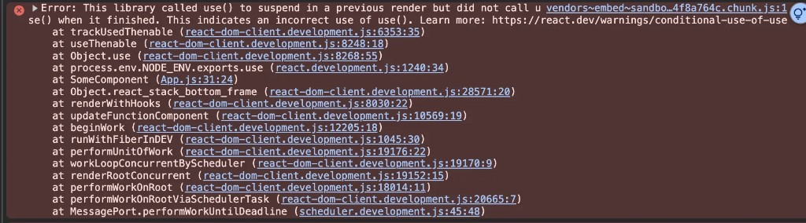

# Colorless React

How promise hacking made React an colorless framework

Without major breaking changes
<span class="opacity-60 text-xl">(you can still use useEffect)</span>

---
layout: two-cols-header
---

## function color

<p class="text-sm opacity-60 mt-1">Bob Nystrom, “What Color is Your Function?” (2015)</p>

::left::

### <span class="text-sky-400">blue</span> (sync)
```ts
function getName(user: User) {
  return user.name;
}
```

- Returns a value
- Can be called from anywhere
- Easy to compose

::right::

### <span class="text-rose-400">red</span> (async)
```ts
async function getName(id: string) {
  const user = await fetchUser(id);
  return user.name;
}
```

- Returns a `Promise`
- Callers must be red (async) too
- Infects the whole stack

<!--
Bob Nystrom, "What Color is Your Function?" (2015).
Async is not just a keyword — it splits the language in two.
You cannot call red from blue. Once one helper awaits, every function above it has to await.
React components are blue (sync): they return JSX, not a Promise.
-->

---

## red (async) functions infect the call stack

You cannot `await` in a blue (sync) function.

```ts {3}
function UserProfile({ userId }: { userId: number }) {
  // TypeError: await is only valid in async functions
  const user = await fetchUser(userId);

  return <h1>{user.name}</h1>;
}
```

<v-clicks>

- React client components are **blue (sync)** — they return JSX, not a Promise
- Need data? Go **red (async)** or move to an effect (`useEffect`, `isPending`)
- That's the color problem: two versions of every function, forever

</v-clicks>

---
layout: two-cols-header
---

## two ways to stay blue (sync)

Both keep the component sync. They disagree about **who waits**.

::left::

### Sync frameworks (React 18)
- You handle loading states
- Everything runs top down
- Manually handling async lifecycle logic
  (pending → success/failure)

::right::

### The Colorless Frameworks (React 19/SolidJS 2)
- The framework handles loading states
- The components will "Suspend" to allow for loading of data
- The framework handles async lifecycle logic

---
layout: default
class: text-sm
---

## the cost for staying blue (sync)

<p class="text-sm opacity-70 mb-4">Click through — the color drains out of the component →</p>

````md magic-move {at:0, lines: true}
```tsx {*|8-14}
// React 18 — you handle loading, errors, and success
export function UserProfile({ userId }: { userId: number }) {
  const { data: user, isPending, isError, error } = useQuery({
    queryKey: ["user", userId],
    queryFn: () => fetchUser(userId),
  });

  if (isPending) {
    return <p>Loading user...</p>;
  }
  if (isError) {
    return <p>Something went wrong</p>;
  }

  return (
    <div>
      <h1>{user.name}</h1>
      <p>{user.email}</p>
    </div>
  );
}
```

```tsx
// Remove manual state checks from the component
export function UserProfile({ userId }: { userId: number }) {
  const { data: user } = useQuery({
    queryKey: ["user", userId],
    queryFn: () => fetchUser(userId),
  });

  return (
    <div>
      <h1>{user.name}</h1>
      <p>{user.email}</p>
    </div>
  );
}
```

```tsx
// Replace useQuery with use(promise)
function UserProfile({ userPromise }: { userPromise: Promise<User> }) {
  const user = use(userPromise);

  return (
    <div>
      <h1>{user.name}</h1>
      <p>{user.email}</p>
    </div>
  );
}
```

```tsx
// Loading and errors moved to the boundary
function UserProfile({ userPromise }: { userPromise: Promise<User> }) {
  const user = use(userPromise);

  return (
    <div>
      <h1>{user.name}</h1>
      <p>{user.email}</p>
    </div>
  );
}

export default function App({ userId }: { userId: number }) {
  const userPromise = fetchUser(userId);

  return (
    <ErrorBoundary fallback={<p>Something went wrong</p>}>
      <Suspense fallback={<p>Loading user...</p>}>
        <UserProfile userPromise={userPromise} />
      </Suspense>
    </ErrorBoundary>
  );
}
```
````

---
layout: two-cols-header
---

## the component never went red (async)

::left::

### `use(promise)`
- Reads a promise inside a **blue (sync)** function
- If pending, the component **pauses**
- When it resolves, React re-renders with the value
- If it rejects, the error bubbles up

::right::

### `<Suspense>`
- Catches paused components above them
- Shows a `fallback` while they wait
- Lets the rest of the tree keep rendering
- Pair with `ErrorBoundary` for failures

---
layout: section
---

# `use` is still a **sync** function

That's supposed to be impossible.

---
class: text-sm
---

## hack 1: throw the promise

Pending is the easy case. Throw, and let the framework pause.

```ts
function use(promise) {
  if (promise.status === "fulfilled") {
    return promise.value; // already done → sync read
  }
  if (promise.status === "rejected") {
    throw promise.reason; // ErrorBoundary
  }
  throw promise; // still pending → Suspense
}
```

1. Component calls `use(promise)` during render
2. If pending, **throw the promise** — React treats this as "pause"
3. Nearest `<Suspense>` catches the promise and shows its fallback
4. When the promise settles, React re-renders and `use` returns the resolved value

<!--
Throwing is how a sync function communicates "I'm not ready" without becoming async.
Suspense is just a try/catch for promises. ErrorBoundary is a try/catch for errors.
-->

---
layout: quote
---

# "React's use hook throws an error until the promise resolves... I cannot decide if this is brilliant or an incredible indictment of JavaScript"

@maxwellcohen

---

## throwing is not enough

A normal Promise is **always** async.

Even after it has resolved, `.then()` still waits a **microtask**.
You cannot synchronously ask a Promise for its value.

<v-clicks>

- Re-render with an already-resolved promise → flash the fallback anyway
- `flushSync()` cannot wait for a microtask
- RSC streaming: data is often **already loaded** when the client reads it
- "Microtasks are bad, mkay." — [Sebastian Markbåge](https://bsky.app/profile/sebmarkbage.calyptus.eu/post/3lku7b7xjmk2w)

</v-clicks>

---
layout: section
---

# hack 2: cache the promise or stable promises only

So a blue (sync) function can read it.

---
layout: default
class: text-sm
---

## same identity, or you suspend forever

`use` needs the **same Promise instance** across renders.

````md magic-move {at:0, lines: true}
```ts
// New promise every render → suspend forever
function UserProfile({ userId }: { userId: number }) {
  const user = use(fetchUser(userId));
  return <h1>{user.name}</h1>;
}
```

```ts
// Cache by key — return the same Promise
const cache = new Map<number, Promise<User>>();

function fetchUserCached(id: number) {
  if (!cache.has(id)) {
    cache.set(id, fetchUser(id));
  }
  return cache.get(id)!;
}

function UserProfile({ userId }: { userId: number }) {
  const user = use(fetchUserCached(userId));
  return <h1>{user.name}</h1>;
}

// Don't mark the cache `async` — that always creates a new Promise
```
````

---
layout: default
class: text-sm
---

## then stamp the result on it

That's what makes the read **synchronous**. No microtask.

Stamp `status` / `value` / `reason` — just like `Promise.allSettled`.

```ts
const cache = new Map<string, Promise<User>>();

function fetchUserCached(id: string) {
  if (!cache.has(id)) {
    const promise = fetchUser(id);
    promise.status = "pending";
    promise.then(
      (value) => {
        promise.status = "fulfilled";
        promise.value = value;
      },
      (reason) => {
        promise.status = "rejected";
        promise.reason = reason;
      },
    );
    cache.set(id, promise);
  }
  return cache.get(id)!;
}
```

<!--
If status is missing, React has to attach its own then() and wait a microtask to learn the result.
If you stamp it yourself, an already-resolved promise is just a sync read — no fallback, no extra render.
-->

---
layout: default
class: text-sm
---

## already-resolved promises

Libraries (and RSC) can hand React a Promise that is **already fulfilled**.

```ts
class ResolvedPromise extends Promise {
  constructor(value) {
    super((resolve) => resolve(value));
    this.status = "fulfilled";
    this.value = value;
  }
}

class RejectedPromise extends Promise {
  constructor(reason) {
    super((resolve, reject) => reject(reason));
    this.status = "rejected";
    this.reason = reason;
  }
}
```

<v-clicks>

- Same field names React already looks for
- Fields can be updated after resolve — streaming can start pending and become fulfilled
- That's how RSC makes already-loaded data **free** on the client

</v-clicks>

<!--
Sebastian Markbåge: https://bsky.app/profile/sebmarkbage.calyptus.eu/post/3lku7b7xjmk2w
-->

---
layout: two-cols-header
class: text-sm
---

## don't skip `use()`

New in React 19.3

::left::

Stamp `status` so React can read it sync.
Don't then skip `use` by reading it yourself.

```ts
// 🔴 bypasses use() once cached
if (promise.status === "fulfilled") {
  return promise.value;
}
const user = use(promise);
```

- If `use()` suspended last render, it has to run again
- Treat `use(promise)` like `await` — always call it

::right::



<!--
The status fields exist for React, not for you.
Libraries used to do: if cached, return the value; else use(promise).
If you suspend with use() and skip it on the next render, React warns:
"This library called use() to suspend in a previous render but did not call use() when it finished."
https://react.dev/warnings/conditional-use-of-use
-->

---
layout: two-cols-header
---

## one function, no color

::left::

### pending
```ts
promise.status === "pending"
```

- `use` throws the promise
- `<Suspense>` shows the fallback
- Your component never became `async`

::right::

### fulfilled
```ts
promise.status === "fulfilled"
promise.value === user
```

- `use` returns `user` on this tick
- No fallback, no microtask
- Same source, same function

---
layout: center
---

# Colorless code is easier

You write as if the data is already there.

The cache makes the promise readable from **blue (sync)** code.
Suspense is what happens when it isn't ready yet.

- No `isPending`. 
- No viral `async`. 
- No second version of every helper.
- No error handling logic


---
layout: end
---

# thanks

 [What Color is Your Function? — Bob Nystrom](https://journal.stuffwithstuff.com/2015/02/01/what-color-is-your-function/)

 [`use` — React docs (caching + status fields)](https://react.dev/reference/react/use)

 [Conditional `use()` warning](https://react.dev/warnings/conditional-use-of-use)
 
 [Sebastian Markbåge on sync-readable promises](https://bsky.app/profile/sebmarkbage.calyptus.eu/post/3lku7b7xjmk2w)
